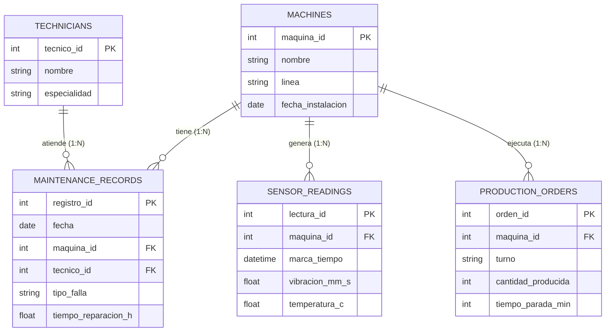

# Semana 5 – Modelo, consulta y limpieza de datos

**Caso:** mantenimiento de maquinaria en una línea de producción industrial (mismo caso de la Semana 4: predecir qué máquinas fallarán en los próximos 7 días, en línea con el uso de tecnologías predictivas para el mantenimiento de activos; Deloitte Insights, 2017).

## 1. ERD

El modelo sigue el enfoque entidad-relación propuesto por Chen (1976): entidades con atributos, relaciones y cardinalidad.



**Cardinalidades:** una máquina tiene 0..N registros de mantenimiento, 0..N lecturas de sensores y 0..N órdenes de producción; cada uno de esos registros pertenece a exactamente 1 máquina (1:N). Un técnico atiende 0..N registros de mantenimiento y cada registro lo atiende 1 técnico (1:N).

El dataset usado en el análisis (`mantenimiento_raw.csv`) es una tabla plana que combina `MAINTENANCE_RECORDS`, `MACHINES`, `TECHNICIANS` y los valores de `SENSOR_READINGS` medidos al momento de la falla.

## 2. Limpieza (pandas) – reporte antes / después

La limpieza se hizo con pandas (McKinney, 2010; pandas development team, s.f.) y busca que cada variable sea una columna y cada observación una fila, siguiendo los principios de *tidy data* (Wickham, 2014).

| Métrica | Antes | Después | Acción |
|---|---|---|---|
| Filas | 520 | 490 | – |
| Duplicados exactos | 20 | 0 | `drop_duplicates()` |
| Nulos `maquina_id` | 11 | 0 | Filas eliminadas (sin máquina no se puede relacionar) |
| Nulos `tecnico` | 30 | 0 | Imputado con `"Sin registro"` |
| Nulos `vibracion_mm_s` | 43 | 0 | Imputado con mediana por tipo de falla |
| Nulos `temperatura_c` | 27 | 0 | Imputado con mediana por tipo de falla |
| Nulos `tiempo_reparacion_h` | 26 | 0 | Imputado con mediana por tipo de falla |
| `tiempo_reparacion_h` | texto (`"3.5 h"`) y valores negativos | `float64` > 0 | Se quitó `" h"`, negativos → nulo → imputado |
| `fecha` | texto, 2 formatos (`2025-03-04` y `04/03/2025`) | `datetime64` | `pd.to_datetime` con cada formato |
| `maquina` | 15 variantes (`prensa a`, `" PRENSA A "`…) | 5 nombres | `strip()` + `title()` |
| `maquina_id` | `float64` | `int64` | `astype(int)` |

## 3. Consultas y hallazgos

**Q1 (filtro por año 2025 + agregación por máquina): fallas y horas de paro.**

| maquina | fallas | horas_paro |
|---|---|---|
| Robot D | 55 | 164.7 |
| Prensa A | 52 | 159.2 |
| Taladro E | 45 | 144.6 |
| Soldadora B | 37 | 119.7 |
| Cinta C | 39 | 110.5 |

*Hallazgo:* el Robot D y la Prensa A concentran más fallas y horas de paro; el Robot D acumula cerca de 49 % más horas que la Cinta C. Son las primeras candidatas a mantenimiento preventivo.

**Q2 (filtro vibración > 6 mm/s + agregación por tipo de falla): casos y tiempo promedio de reparación.**

| tipo_falla | casos | reparacion_prom_h |
|---|---|---|
| Rodamiento | 101 | 5.00 |
| Electrica | 11 | 2.18 |
| Lubricacion | 6 | 2.33 |
| Sobrecalentamiento | 4 | 2.50 |

*Hallazgo:* cerca del 83 % de las fallas con vibración alta son de rodamiento, y además tardan más del doble en repararse. Esto sugiere que la vibración es una variable útil para el modelo predictivo de la pregunta de datos.

## Data & cleaning

The dataset is a simulated maintenance log (`mantenimiento_raw.csv`) with 520 rows describing failures of five production-line machines, including the failure type, technician, repair time, and the vibration and temperature measured at the time of the failure. It was intentionally messy: it had 20 duplicated rows, missing values in five columns, repair times stored as text such as "3.5 h", some negative repair times, two different date formats, and 15 different spellings of only five machine names. I cleaned it with pandas by removing duplicates, trimming and standardizing machine names, converting dates and repair times to proper types, dropping rows without a machine ID, and imputing the remaining missing values with the median by failure type. After cleaning, the file has 490 rows and no missing values, so it is ready to be joined with other sources in the project, following the tidy data principles described by Wickham (2014). The first question asked which machines accumulate the most downtime hours in 2025, and the Robot D and the Prensa A were at the top. The second question asked which failure types appear when vibration is above 6 mm/s, and bearing failures represent about 83% of those cases and take longer to repair, which supports using vibration data to predict failures.

## Referencias

Chen, P. P.-S. (1976). The entity-relationship model—Toward a unified view of data. *ACM Transactions on Database Systems, 1*(1), 9–36.

Deloitte Insights. (2017). *Industry 4.0 and predictive technologies for asset maintenance*. Deloitte. https://www.deloitte.com/us/en/insights/industry/manufacturing-industrial-products/industry-4-0/using-predictive-technologies-for-asset-maintenance.html

McKinney, W. (2010). Data structures for statistical computing in Python. En S. van der Walt & J. Millman (Eds.), *Proceedings of the 9th Python in Science Conference* (pp. 56–61). https://doi.org/10.25080/Majora-92bf1922-00a

pandas development team. (s.f.). *Working with missing data*. pandas documentation. https://pandas.pydata.org/docs/user_guide/missing_data.html

Wickham, H. (2014). Tidy data. *Journal of Statistical Software, 59*(10), 1–23. https://doi.org/10.18637/jss.v059.i10

## Cómo ejecutar

```bash
pip install pandas numpy
python analisis.py
```
El script crea `mantenimiento_raw.csv`, lo carga, imprime el reporte antes/después y las dos consultas.
